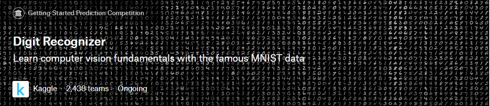

# Image-with-deep-learning
이미지에 관한 딥러닝

<!-- <pre><code><pre/><code/>안에 코드를 넣으면 된다 -->
| 주제 |이미지를 누르면 데이터를 다운로드하는 곳으로 이동합니다.| 코드주소 |
|------|-----|----------|
|mnist|<a href="https://www.kaggle.com/c/digit-recognizer/data" target="_blank">|[기본 예제](https://github.com/kwong3528/Image-with-deep-learning/blob/master/mnist(%EC%88%AB%EC%9E%90%EB%B6%84%EB%A5%98)/%EC%88%AB%EC%9E%90%EB%B6%84%EB%A5%98.ipynb)|

#### mnist에 대한 기본 예제이다.

----------
<!-- <pre><code><pre/><code/>안에 코드를 넣으면 된다 -->
| 주제 |이미지를 누르면 데이터를 다운로드하는 곳으로 이동합니다.| 코드주소 |
|------|-----|----------|
|mnist|<a href="https://www.kaggle.com/c/dogs-vs-cats/data" target="_blank">|[기본 예제](https://github.com/kwong3528/Image-with-deep-learning/blob/master/resnet/%EB%A0%88%EC%8A%A4%EB%84%B7.ipynb)|

#### 개와 고양이를 resnet으로 학습시켰다. 2258장에 대해 94프로가 넘는 정확도를 보여주었다.
